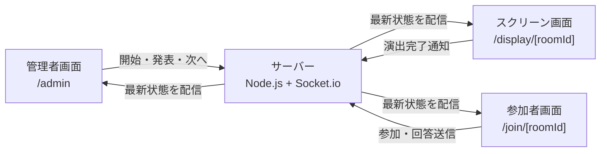

# プロジェクト説明資料

この資料は、このプロジェクトの入門ドキュメントです。

## 1. このアプリは何か

このプロジェクトは、テレビ番組の「パーセントバルーン」のようなクイズを、学部対抗イベントで遊べるようにしたリアルタイムWebアプリです。

参加者はスマホでQRコードから参加し、0〜100%の数字を回答します。
大型スクリーンには問題、各学部の回答状況、正解発表のゲージ、風船が割れる演出、最終ランキングが表示されます。
管理者は別画面から、ルーム作成、ゲーム開始、正解発表、次の問題への進行を操作します。

## 2. 使っている言語・フレームワーク

このプロジェクトは主に TypeScript で書かれています。

| 分類 | 使用技術 | 役割 |
|---|---|---|
| 言語 | TypeScript | JavaScriptに型を付けた言語。ミスを早く見つけやすい |
| フロントエンド | Next.js 14 | 画面を作るためのReactフレームワーク |
| UI | React | ボタン、カード、画面などを部品として作る |
| CSS | Tailwind CSS | `className` で素早く見た目を調整する |
| アニメーション | Framer Motion | ゲージやカードなどの動きを作る |
| リアルタイム通信 | Socket.io | 管理画面、参加者画面、スクリーン画面を即時同期する |
| サーバー | Node.js + Express | ルームやゲーム状態を管理する |
| パッケージ管理 | pnpm | 依存ライブラリの管理と起動コマンドの実行 |

## 3. 画面の種類

このアプリには主に3つの画面があります。

| URL | 画面 | 使う人 | 役割 |
|---|---|---|---|
| `/admin` | 管理者画面 | 司会・運営 | 問題作成、ルーム作成、ゲーム進行 |
| `/display/[roomId]` | スクリーン画面 | 観客全員 | QR、問題、演出、ランキングを表示 |
| `/join/[roomId]` | 参加者画面 | 各学部の代表者 | 学部選択、回答入力、結果確認 |

`[roomId]` はルームIDが入る場所です。
例えばルームIDが `ABC123` なら、参加者画面は `/join/ABC123`、スクリーン画面は `/display/ABC123` になります。

## 4. フォルダ構成

このプロジェクトは、1つのリポジトリの中に複数の小さなプロジェクトが入っている構成です。
これをモノレポと呼びます。

```text
husen/
├── web/      # 画面側。Next.js / React
├── server/   # サーバー側。Express / Socket.io
├── shared/   # web と server の両方で使う型定義
└── docs/     # 説明資料
```

### `web/`

ユーザーがブラウザで見る画面を担当します。

主なファイル:

| ファイル | 役割 |
|---|---|
| `web/src/app/admin/page.tsx` | 管理者画面 |
| `web/src/app/display/[roomId]/page.tsx` | スクリーン画面 |
| `web/src/app/join/[roomId]/page.tsx` | 参加者画面 |
| `web/src/components/GaugeBar.tsx` | 正解発表のゲージバー |
| `web/src/components/BalloonBurstShow.tsx` | 風船が割れる演出画面 |
| `web/src/components/RemainingBalloon.tsx` | 残り風船・予想のバルーン表示 |
| `web/src/lib/socket.ts` | Socket.ioでサーバーに接続する処理 |
| `web/src/lib/sounds.ts` | BGMや効果音の処理 |
| `web/src/middleware.ts` | `/admin` にパスワードをかける処理 |

### `server/`

ゲームの状態を管理します。
例えば、どの学部が参加しているか、今何問目か、回答は何%か、残り風船はいくつかを持っています。

主なファイル:

| ファイル | 役割 |
|---|---|
| `server/src/index.ts` | サーバー起動、Socket.io設定 |
| `server/src/handlers.ts` | クライアントから来たイベントを受け取る |
| `server/src/rooms.ts` | ゲームルール、ルーム、風船数、順位計算 |

### `shared/`

`web` と `server` の両方で使う共通の型を置いています。
例えば「チーム」「問題」「ルーム状態」「正解発表結果」などです。

`shared/src/index.ts` に定義されています。

## 5. なぜSocket.ioを使っているのか

このゲームでは、管理者が「正解発表」を押したら、スクリーンや参加者端末にもすぐ反映される必要があります。
普通のWebページのように毎回更新ボタンを押す仕組みでは、イベント用途では遅くて不便です。

そこで Socket.io を使っています。
Socket.io は、ブラウザとサーバーをつなぎっぱなしにして、必要なタイミングで即座に情報を送る仕組みです。

例:

```text
管理者が「ゲーム開始」を押す
  ↓
server が状態を answering に変える
  ↓
server が全画面に room:updated を送る
  ↓
参加者画面とスクリーン画面がすぐ切り替わる
```

## 6. 全体のデータの流れ

ざっくり言うと、サーバーがゲーム状態の中心です。
各画面はサーバーに命令を送ったり、サーバーから最新状態を受け取ったりします。



ポイントは、参加者画面同士が直接通信していないことです。
必ずサーバーを通して状態を共有しています。

## 7. ゲームの流れ

ゲームにはフェーズという状態があります。
フェーズによって、各画面に表示する内容が変わります。

| フェーズ | 意味 |
|---|---|
| `lobby` | 参加者を待っている状態 |
| `answering` | 回答受付中 |
| `waiting` | 全員回答済み。管理者の発表待ち |
| `revealing` | スクリーンで正解発表アニメーション中 |
| `result` | 参加者にも結果を表示してよい状態 |
| `finished` | ゲーム終了、ランキング表示 |

流れは次のようになります。

```text
lobby
  ↓ 管理者がゲーム開始
answering
  ↓ 全員が回答
waiting
  ↓ 管理者が正解発表
revealing
  ↓ スクリーン演出が終わる
result
  ↓ 管理者が次の問題へ
answering または finished
```

## 8. 回答と風船数の計算

回答は 0〜100 の整数です。
正解との差が誤差になります。

例:

```text
正解: 40%
回答: 34%
誤差: 6ポイント
```

基本ルール:

- 誤差の数だけ風船が割れる
- 正解ぴったりなら風船が減らず、ボーナスで増える
- 風船が0以下になると脱落
- 未回答は大きなペナルティとして扱う

この計算は `server/src/rooms.ts` の `revealAnswer` で行っています。

## 9. 正解発表の演出

正解発表では、すぐに答えを出さず、スクリーン上でゲージバーを動かして盛り上げます。

主な流れ:

1. 管理者が「正解発表」を押す
2. サーバーが正解と各学部の結果を計算する
3. スクリーン画面でBGMと一緒にゲージバーが動く
4. ゲージが正解位置で止まる
5. 風船を割る演出が入る
6. 演出が終わったら参加者端末にも結果が表示される

重要なのは、参加者端末にはスクリーンより先に結果を出さないようにしている点です。
イベントではスクリーンの演出が主役なので、参加者スマホに先に結果が出ると盛り上がりが弱くなります。

## 10. 管理者パスワードについて

`/admin` は管理者だけが触る画面なので、パスワードを設定できます。

設定する場所は `web/.env.local` です。

```env
ADMIN_USER=admin
ADMIN_PASSWORD=好きなパスワード
```

この値は `NEXT_PUBLIC_` を付けていません。
理由は、`NEXT_PUBLIC_` を付けるとブラウザ側に公開されてしまうためです。

このプロジェクトでは `web/src/middleware.ts` で `/admin` へのアクセス時にパスワードを確認しています。

## 11. 他の端末から参加できる仕組み

開発中はWeb画面が `3000` 番、サーバーが `3001` 番で動きます。

```text
web:    http://localhost:3000
server: http://localhost:3001
```

同じWi-Fi内のスマホから参加する場合は、`localhost` ではなくMacのIPアドレスで管理画面を開きます。

例:

```text
http://192.168.1.23:3000/admin
```

そうすると、QRコードにもそのIPアドレスが入るため、スマホからアクセスできます。

## 12. このアプリでデータベースを使っていない理由

このプロジェクトでは、ルームや回答データをサーバーのメモリ上に保存しています。
つまり、サーバーを再起動するとルーム情報は消えます。

イベント用の短時間ゲームなので、データベースを入れて複雑にするより、シンプルに動くことを優先しています。

ただし、長期間ランキングを保存したい場合や、あとから結果を見返したい場合は、将来的にデータベースを追加する必要があります。

## 13. よく聞かれそうな質問と答え方

### Q. このアプリは何で作っていますか？

TypeScript、Next.js、React、Socket.io、Node.jsで作っています。
画面はNext.js、リアルタイム通信はSocket.io、ゲーム状態の管理はNode.jsサーバーで行っています。

### Q. なぜリアルタイムに画面が変わるのですか？

Socket.ioでブラウザとサーバーを常につないでいるからです。
管理者が操作すると、サーバーが全画面に最新状態を送るので、参加者画面やスクリーン画面がすぐ変わります。

### Q. サーバーは何をしていますか？

ルーム作成、参加者管理、回答受付、正解判定、風船数計算、順位計算をしています。
このアプリではサーバーがゲーム状態の中心です。

### Q. フロントエンドは何をしていますか？

管理者画面、参加者画面、スクリーン画面を表示しています。
また、サーバーから受け取った状態をもとに、ゲージや風船のアニメーションを動かしています。

### Q. 参加者の回答はどこに保存されていますか？

サーバーのメモリ上に保存されています。
データベースは使っていないので、サーバーを再起動すると消えます。

### Q. `/admin` のパスワードは安全ですか？

パスワードは環境変数 `ADMIN_PASSWORD` に置き、ブラウザに直接埋め込まないようにしています。
ただし、Basic認証なので本格的なログインシステムではありません。
イベント用の簡易保護として使う想定です。

### Q. なぜ `shared/` があるのですか？

サーバーと画面で同じデータ形式を使うためです。
例えば `RoomSnapshot` という型を共有することで、サーバーが送るデータと画面が受け取るデータの形をそろえられます。

### Q. どこを見ればゲームルールが分かりますか？

`server/src/rooms.ts` を見ると、ゲームルールがまとまっています。
特に `startGame`、`submitAnswer`、`revealAnswer`、`getRanking` が重要です。

### Q. どこを見れば画面の見た目が分かりますか？

`web/src/app/display/[roomId]/page.tsx` や `web/src/components/` を見ると分かります。
スクリーン演出は `GaugeBar.tsx` と `BalloonBurstShow.tsx` が中心です。

## 14. 最初に覚えるべきファイル

全部を一度に理解する必要はありません。
まずは次の順番で読むと理解しやすいです。

1. `README.md`
2. `docs/GAME_FLOW.md`
3. `shared/src/index.ts`
4. `server/src/rooms.ts`
5. `web/src/app/display/[roomId]/page.tsx`
6. `web/src/app/join/[roomId]/page.tsx`
7. `web/src/app/admin/page.tsx`

## 15. 一言で説明するなら

このアプリは、スマホ参加型の学部対抗パーセントクイズを行うためのリアルタイムWebアプリです。
Next.jsで画面を作り、Node.jsとSocket.ioで全端末を同期し、サーバー側で回答や風船数を管理しています。
